# Nexora 当前本体架构

状态：当前实现快照，基于 `2.8.5` 开发线。最后核对：2026-08-12。

## 1. 总体分层

```mermaid
flowchart TB
  UI[React 前端 Shell\n固定工具带、模板、标签与设置]
  Tauri[Tauri/Rust 宿主\n命令、窗口、进程、文件与事件]
  Profile[Profile Runtime\n装配方案、迁移、切换、恢复]
  Legacy[内部兼容适配层\n旧 Module 生命周期与资源登记]
  Bridge[Component Bridge\n依赖、命令、上下文与取消]
  Capability[Capability Gateway\n一次性令牌、范围与审计]
  Component[Component Runtime\n安装、签名、监督、取消、模板]
  Automation[Script Automation\nPython SDK、事件、cron、运行历史]
  Domains[业务域\n文件操作、渲染、局域网、媒体与项目会话]
  Storage[(应用数据、项目 .pm_center、\n组件目录与业务 SQLite)]

  UI <--> Tauri
  Tauri --> Profile
  Profile --> Legacy
  Profile --> Component
  Legacy --> Capability
  Component --> Bridge
  Bridge --> Capability
  Component --> Capability
  Automation --> Component
  Automation --> Capability
  Legacy --> Domains
  Bridge --> Domains
  Component --> Domains
  Tauri --> Storage
  Domains --> Storage
```



前端不直接拥有后台服务。它读取 Profile、Component 和内部兼容适配层的运行时快照，以受控贡献目录决定页面、工具、设置区、文件处理器和 Shell 标签是否可见。Rust 宿主才拥有数据库、监听端口、watcher、子进程、窗口和 Capability 令牌。

## 2. 三个用户对象与内部兼容层

| 对象 | 职责 | 能否安装/卸载 | 数据边界 |
| --- | --- | --- | --- |
| **内部 Module 兼容层** | 迁移期承接旧内置生命周期与资源登记。普通用户和第三方开发者不直接配置或开发 Module。 | 不作为第三方安装单元。 | 由宿主内部管理。 |
| **Component** | 可替换的服务、功能或资料包，例如文件操作、BlenderIO、Python 自动化、文件处理器、模板、EXE、DLL。 | 是。随附组件也可卸载并重新安装。 | 组件运行时目录及组件自己的受控状态。 |
| **Profile** | 用户装配方案：启用哪些组件、主页、导航、快捷栏、模板插槽、设置、自动化绑定和本机映射。 | 可以创建、复制、导入、导出、切换或删除非受保护方案。 | 软件级 Profile 存储；不携带项目绝对路径、凭据和用户私密数据。 |
| **Project** | 用户项目目录及其 `.pm_center` 元数据、索引、缓存、集合和项目级状态。 | 打开/关闭，不等于启用 Module。 | 项目根目录的 `.pm_center`；关闭项目后释放 watcher、数据库和 TreeCache。 |

组件不存在“内核/普通”的权限等级。所有公开组件都经 Capability Gateway、依赖校验和统一安装模型处理。`builtin-rust` 是迁移兼容运行时，不是不可卸载特权。

## 3. 启动、装配与页面

```text
应用启动
  -> 读取/迁移 Profile 与本机绑定
  -> 解析有效 Component 闭包和旧 Module 兼容适配
  -> 启动组件与适配层声明的后台资源
  -> 同步 Component Registry 与 Capability 目录
  -> 恢复 Shell、项目和工作区会话
  -> 触发 app.started 自动化事件
```

Profile 的 `shellLayout.home` 只表示启动时激活的 Surface。它不垄断页面入口：独立 Shell 页面应同时有导航项与可 Pin 工具入口，打开后聚焦同一个单例 Shell 标签。项目工作区标签则是按项目路径单例。

Profile 切换是事务：先预检依赖、组件、Capability、模板与引用；再停止旧资源、应用新闭包、提交 Profile，失败会回滚。停用组件只撤下入口和资源，不自动删除项目、组件、Profile 或业务历史。

## 4. 贡献与显示边界

组件清单与内部兼容适配层都可声明贡献。前端维护受控目录，后端清单声明所有权，运行时必须同时满足：

1. 贡献 ID 在前端目录有定义；
2. 当前有效组件或内部适配层声明并拥有该贡献；
3. 宿主存在对应渲染器、处理器或安全实现；
4. 相关 Capability、依赖和 Profile 引用有效。

这避免了“前端显示了入口、后台模块已停用”的半失效状态。组件卸载或停用后，文件路由、页面和工具会重新计算；已保存的逻辑绑定保留为可诊断的缺失引用，不会被静默删除。

## 5. 运行时与安全模型

### Component Runtime

当前支持 `python-action`、`python-worker`、`native-process`、`native-library`、`data-pack` 与迁移期 `builtin-rust`。每个操作拥有 `operationId`、日志、PID、超时、并行上限、内存采样、取消和进程树清理。DLL 只由 `pmc-component-host` 隔离进程加载，不能进入 Nexora 主进程。

组件目录、签名信任库、日志、暂存、备份和回收目录位于应用数据目录。安装/升级先校验清单、路径、平台、依赖、签名、压缩内容和入口，之后在 staging 解压并使用同卷原子提交。卸载会先检查运行中操作、组件依赖、自动化和表现模板引用。

### Capability Gateway

Capability 按实际动作和范围授权，例如项目文件读写、项目外路径、进程、网络、通知、渲染队列。请求通过一次性令牌进入组件调用，令牌主体必须与 Module、Component、操作和范围一致。组件的清单声明能力不是自动授权。

Python 是**受信任代码模型**：SDK 和宿主接口受网关约束，但 Python 标准库仍运行在当前 Windows 用户权限下。只有签名包或用户在开发模式中显式信任的目录可以执行脚本组件。

### 脚本自动化

`builtin.script-automation` 基于 Component Runtime 执行自动化命令。Profile 保存手动、事件和 cron 绑定；运行数据库保存输入快照、不可变 Manifest 摘要、尝试、日志、权限等待和 `attention`。`pure`/`idempotent` 运行可以按规则恢复，`non-idempotent` 的中断结果必须人工处理。第三方 Script Surface 可从功能中心打开，也可作为当前界面模板的 component-surface 插槽内容；它仍不能注入宿主 DOM、直接调用 Tauri 或获得任意 Widget/右键菜单宿主。

## 6. 数据位置与所有权

| 范围 | 典型内容 | 所有者与关闭规则 |
| --- | --- | --- |
| 应用数据 | Profile、组件目录、自动化运行、局域网联系人/历史、全局设置、外部渲染站、媒体资料库书签 | Nexora 软件级数据；卸载是否保留由安装流程决定。 |
| 项目 `.pm_center` | 项目数据库、TreeCache、缩略图、文件详情、集合、项目级组件状态、项目渲染结果关联 | 打开项目时申请资源；关闭项目后释放句柄，但不删除用户数据。 |
| 用户选定资料库 | `media_catalog.db`、可选归档 `media/` | 媒体资料库独立管理；基础媒体库不要求项目 Module。 |
| 组件包目录 | `component.json`、入口、资源、安装状态、组件日志 | Component Runtime 安装事务管理，组件不可直接假设宿主目录结构。 |
| 导出包 | `.pmc-profile`、`.pmc-workspace`、`.pmc-pack`、`.pmc-renderpack` | 均有 Schema、BLAKE3 和导入检查；不得打包凭据、聊天、项目源文件或私钥。 |

## 7. 业务域边界

- **文件操作**：通过受控项目路径和已授权外部路径提供文件、缓存、Watcher 与项目上下文操作；组件不能直接访问 TreeCache 或项目数据库。
- **渲染中心**：Blender Worker、帧领取、输出提交、性能采样和视频打包。它的外部渲染站使用应用数据私有队列，不强制打开项目。
- **局域网协同**：软件级发现、联系人、聊天与传输；不属于任何单个项目。
- **媒体资料库**：软件级、可停用的独立资料库；项目级媒体关联应由后续“项目媒体桥接”组件提供，而不反向绑定基础库到项目 watcher。
- **文件意图路由**：双击、右键打开、预览、编辑和检查先由有效组件的文件处理器决定；普通打开在没有可用处理器时降级系统程序。

## 8. 代码与合同入口

| 主题 | 权威入口 |
| --- | --- |
| Schema 与语义验证 | `shared/pmc-platform/src/`、`shared/pmc-platform/schemas/v1/` |
| 平台组合、Profile、能力、组件 | `src-tauri/src/platform/` |
| 内置 Module 与 Component 清单 | `src-tauri/src/platform/builtin_modules.rs`、`builtin_components.rs` |
| Tauri 命令注册 | `src-tauri/src/lib.rs` |
| 前端贡献目录与可用性 | `src/features/contributionRegistry.ts`、`contributionCatalogDiagnostics.ts` |
| Shell/项目标签与页面渲染 | `src/stores/shellTabStore.ts`、`src/components/shell/`、`src/components/workspace/` |
| 脚本 SDK 和样例 | `src-tauri/resources/script-sdk/`、`examples/components/script-automation-*` |

第三方开发者不应把本体内部 Rust 函数、Tauri command 名称、React 组件路径或数据库表名当作稳定扩展 API。稳定入口见 [../extension-development/INTERFACE_REFERENCE.md](../extension-development/INTERFACE_REFERENCE.md)。
