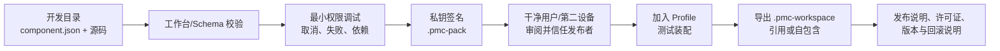

# 装配空间制作与开发模式

## 1. 四种交付物不要混用

| 交付物 | 解决的问题 | 是否携带组件 | 是否携带项目 |
| --- | --- | --- | --- |
| `.pmc-pack` | 安装一个组件 | 是，单个组件本体 | 否 |
| `.pmc-profile` | 分享功能选择与界面配置 | 否，只引用依赖 | 否 |
| `.pmc-workspace` | 分享可复现的装配空间 | `references-only` 不携带；`self-contained` 可携带可分发组件原包 | 否 |
| 项目目录 | 分享项目文件、`.pm_center` 与工作成果 | 不应混入 | 是 |

装配空间不是安装包，也不是项目压缩包。它描述“在一份 Nexora 上如何组合功能”，不能偷偷携带密钥、聊天记录、绝对机器路径或项目文件。

## 2. 制作一个装配空间

1. 在装配编辑器新建方案，或复制一个现有方案。直接编辑当前方案前先创建副本。
2. 选择 Module 和 Component。先解决依赖、版本、Capability、模板和缺失组件，再保存。
3. 配置启动主页、导航、快捷栏、Surface、Widget、设置、自动化绑定、路径变量与工具别名。
4. 对无项目页面使用 Shell 单例入口；对项目页面确认关闭/重开项目不会丢失 `.pm_center` 数据。
5. 在普通宽度、窄窗口、浅色/深色、无项目/有项目下检查布局；停用一个组件后确认只撤下它的入口，不删除用户数据。
6. 先导出 `.pmc-profile` 做逻辑分享；需要把依赖组件一并交付时导出 `.pmc-workspace`。

工作区导入会先显示依赖、版本、模板、路径变量和工具映射。导入只创建新 Profile，不会自动切换或启动任务；由用户明确应用。

## 3. `references-only` 与 `self-contained`

| 模式 | 适合情况 | 行为 |
| --- | --- | --- |
| `references-only` | 内部团队统一从可信源安装组件，或只分享布局 | 只保存组件 ID/版本要求和 Profile。接收端自行安装匹配组件。 |
| `self-contained` | 离线团队、演示包、受控交付 | 仅嵌入已验证、已缓存原始归档、发布者签名有效且声明可重新分发的 `.pmc-pack`。 |

即使是 `self-contained`，导入端遇到同 ID 不同版本的本机组件也会停止，不能静默替换。任一组件安装、Profile 保存或本机映射失败时，导入将回滚本次新增组件和新 Profile。

## 4. 只有 EXE 的开发模式

### A. 制作脚本组件

在功能中心打开脚本自动化工作台，创建组件模板到普通工作目录。该目录可用本地编辑器修改。工作台提供：校验、信任/解除信任、热重载、运行调试、日志、Script Surface 预览、自动化绑定和签名打包。

目录信任与包信任不同：

- **开发目录信任**：允许本机未打包的 Python 代码执行，适合你自己的源目录；
- **发布者信任**：允许一个 Ed25519 发布者签名的 `.pmc-pack` 安装和执行，适合接收别人的正式包。

不要把“开发目录已信任”当成可分发安全证明。发布前必须打包、签名并在干净用户环境重新安装。

### B. 制作资料或表现模板

创建 `data-pack` 组件，在组件运行时区域从目录安装进行验证。模板只能描述经静态净化的 `baseHtml`、样式、资源和地区域；Nexora 恢复容器始终保留，模板缺失或加载失败时回退安全 Shell。

### C. 制作原生组件

`native-process` 和 `native-library` 都需要自行构建二进制。优先选择 EXE，除非已明确需要 DLL 的性能或 ABI。DLL 需要 Windows 架构匹配并通过隔离宿主握手，调试和兼容成本最高。

## 5. 一个可维护的团队交付流程

建议将组件源码、组件包、Profile/空间和项目文件分开版本控制：

- 源码仓库保存 `component.json`、代码、资源、测试和 README；
- Release 保存签名 `.pmc-pack`、哈希和许可证；
- 装配仓库保存 `.pmc-profile`/`.pmc-workspace` 与所需组件版本清单；
- 项目仓库或 NAS 保存用户项目及 `.pm_center`，不放私钥。

## 6. 验收与回滚

每个装配或组件发布应至少记录：Nexora 版本、`apiVersion`、组件版本和摘要、发布者 ID、受支持平台、依赖、所需 Capability、已知限制和卸载/回滚方式。

在生产环境中，优先以“新 Profile + 新组件版本”方式试运行。不要覆盖当前正在使用的 Profile，不要在运行中的非幂等自动化、渲染 Worker 或受引用模板上强制卸载组件。失败时切回原 Profile、取消任务、卸载新组件或恢复随附组件；项目文件和 `.pm_center` 不应被装配导入删除。
